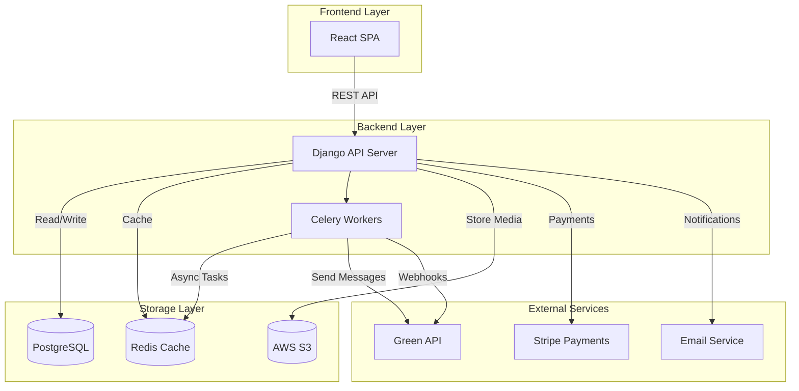
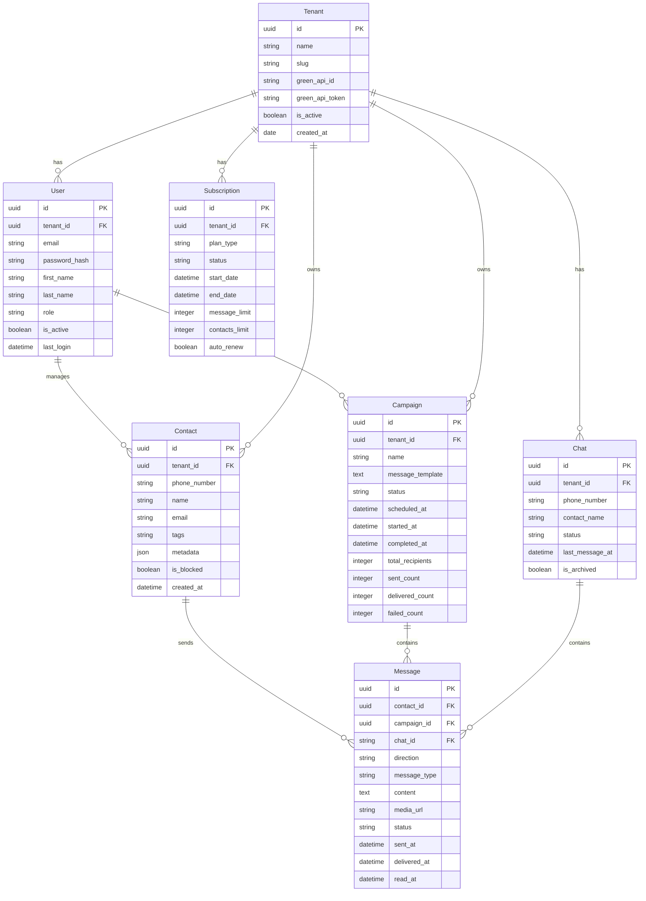

# Viviz Bulk Sender - WhatsApp SaaS Platform

## Executive Summary

A comprehensive SaaS platform for bulk WhatsApp messaging with CRM integration, chat inbox, media sharing, message scheduling, and analytics. Built using Django (backend) and React (frontend), integrated with Green API for WhatsApp communication.

## Tech Stack

- **Backend**: Django 5.x with Django REST Framework
- **Frontend**: React 18 with TypeScript
- **Database**: PostgreSQL
- **Cache**: Redis
- **Task Queue**: Celery with Redis broker
- **File Storage**: AWS S3 (or local for dev)
- **Payment**: Stripe
- **Authentication**: JWT with Django REST Framework SimpleJWT
- **API**: Green API (Python SDK)
- **Containerization**: Docker
- **CI/CD**: GitHub Actions

## System Architecture



## Database Schema

### Core Models



## Feature Breakdown

### 1. Multi-Tenancy & Authentication
- Organization-based multi-tenancy
- JWT token authentication
- Role-based access control (Admin, Manager, Agent)
- Invite system for team members
- SSO support (future)

### 2. Green API Integration
- Instance management (create, configure, delete)
- QR code generation for WhatsApp pairing
- Send text, image, video, document, audio messages
- Receive messages via webhooks
- Message status tracking (sent, delivered, read)
- Group messaging support

### 3. Contact Management & CRM
- Bulk contact import (CSV, Excel)
- Contact segmentation by tags
- Custom fields and metadata
- Contact search and filtering
- Contact activity tracking
- Contact blocking/unblocking
- Merge duplicate contacts

### 4. Bulk Message Sending
- Campaign creation wizard
- Message template system
- Variable substitution (personalization)
- Schedule campaigns for future delivery
- Throttling to avoid rate limiting
- Real-time campaign progress tracking
- Bulk message cancellation
- A/B testing for messages

### 5. Chat Inbox
- Real-time message streaming
- Multi-conversation support
- Agent assignment and routing
- Auto-reply rules
- Quick reply templates
- Message search
- Conversation history
- Star/bookmark messages

### 6. Media Sharing
- Image upload and sending
- Document sharing (PDF, DOCX, etc.)
- Audio messages
- Video messages
- Media gallery
- Secure file storage
- File type validation

### 7. Message Scheduling
- Schedule single messages
- Schedule campaigns
- Schedule recurring messages
- Timezone support
- Schedule calendar view
- Bulk schedule management
- Schedule cancellation

### 8. Analytics & Reports
- Message delivery statistics
- Campaign performance metrics
- Agent productivity reports
- Contact engagement metrics
- Revenue analytics
- Custom report builder
- Export reports (PDF, CSV)
- Real-time dashboards

### 9. Subscription Tiers
- Free Tier: 100 messages/month, 50 contacts
- Basic: 5,000 messages/month, 1,000 contacts
- Pro: 25,000 messages/month, 10,000 contacts
- Enterprise: Unlimited, dedicated support
- Monthly/Annual billing
- Usage-based overage pricing

## API Endpoints

### Authentication
```
POST /api/auth/register/
POST /api/auth/login/
POST /api/auth/refresh/
POST /api/auth/logout/
GET  /api/auth/me/
```

### Tenants
```
GET  /api/tenants/
POST /api/tenants/
GET  /api/tenants/{id}/
PUT  /api/tenants/{id}/
DELETE /api/tenants/{id}/
POST /api/tenants/{id}/invite/
GET  /api/tenants/{id}/usage/
```

### Contacts
```
GET  /api/contacts/
POST /api/contacts/
POST /api/contacts/bulk-import/
GET  /api/contacts/{id}/
PUT  /api/contacts/{id}/
DELETE /api/contacts/{id}/
POST /api/contacts/{id}/tags/
GET  /api/contacts/export/
```

### Campaigns
```
GET  /api/campaigns/
POST /api/campaigns/
GET  /api/campaigns/{id}/
PUT  /api/campaigns/{id}/
DELETE /api/campaigns/{id}/
POST /api/campaigns/{id}/start/
POST /api/campaigns/{id}/pause/
POST /api/campaigns/{id}/cancel/
GET  /api/campaigns/{id}/stats/
```

### Messages
```
GET  /api/messages/
POST /api/messages/send/
POST /api/messages/schedule/
GET  /api/messages/{id}/
DELETE /api/messages/{id}/
GET  /api/messages/history/{phone_number}/
```

### Chats
```
GET  /api/chats/
GET  /api/chats/{id}/
PUT  /api/chats/{id}/
POST /api/chats/{id}/assign/
POST /api/chats/{id}/close/
GET  /api/chats/{id}/messages/
POST /api/chats/{id}/messages/
```

### Analytics
```
GET  /api/analytics/overview/
GET  /api/analytics/messages/
GET  /api/analytics/campaigns/
GET  /api/analytics/agents/
GET  /api/analytics/export/
```

### Subscriptions
```
GET  /api/subscriptions/
POST /api/subscriptions/
GET  /api/subscriptions/{id}/
POST /api/subscriptions/{id}/cancel/
POST /api/subscriptions/{id}/upgrade/
GET  /api/subscriptions/plans/
```

## Green API Integration Details

### Instance States
- `created` - Instance created
- `running` - Connected to WhatsApp
- `stopped` - Disconnected
- `failed` - Connection error

### Message Types Support
- `text` - Plain text messages
- `image` - Image with optional caption
- `video` - Video files
- `document` - PDF, DOCX, etc.
- `audio` - Voice notes, audio files
- `contact` - Contact cards
- `location` - Geo locations

### Webhook Events
- `messageReceived` - Incoming message
- `messageSent` - Outgoing message delivered
- `messageRead` - Message read by recipient
- `instanceStatusChanged` - Connection status changed
- `contactAdded` - New contact
- `groupInvite` - Group invite received

## Project Structure

```
viviz-bulk-sender/
├── backend/
│   ├── manage.py
│   ├── requirements.txt
│   ├── Dockerfile
│   ├── docker-compose.yml
│   ├── config/
│   │   ├── __init__.py
│   │   ├── settings/
│   │   │   ├── __init__.py
│   │   │   ├── base.py
│   │   │   ├── development.py
│   │   │   └── production.py
│   │   ├── urls.py
│   │   └── wsgi.py
│   ├── apps/
│   │   ├── authentication/
│   │   ├── tenants/
│   │   ├── contacts/
│   │   ├── campaigns/
│   │   ├── messages/
│   │   ├── chats/
│   │   ├── analytics/
│   │   ├── subscriptions/
│   │   └── green_api/
│   ├── templates/
│   └── static/
├── frontend/
│   ├── package.json
│   ├── Dockerfile
│   ├── src/
│   │   ├── index.tsx
│   │   ├── App.tsx
│   │   ├── api/
│   │   ├── components/
│   │   ├── pages/
│   │   ├── hooks/
│   │   ├── context/
│   │   ├── services/
│   │   ├── types/
│   │   └── utils/
│   └── public/
├── scripts/
├── docs/
└── plans/
```

## Implementation Phases

### Phase 1: Foundation
- Project setup and configuration
- Database models and migrations
- Authentication system
- Multi-tenancy implementation
- Basic API endpoints

### Phase 2: Core Features
- Green API integration
- Contact management
- Basic message sending
- Webhook handling

### Phase 3: Advanced Features
- Campaign management
- Bulk sending with throttling
- Chat inbox
- Auto-reply system

### Phase 4: Media & Scheduling
- Media upload and sharing
- Message scheduling
- Background task workers

### Phase 5: SaaS Features
- Subscription tiers
- Stripe integration
- Usage tracking
- Billing management

### Phase 6: Analytics & Reports
- Analytics dashboard
- Report generation
- Export functionality
- Real-time statistics

### Phase 7: Polish & Deploy
- Unit and integration tests
- CI/CD setup
- Production deployment
- Documentation

## Security Considerations

- All API endpoints authenticated
- Tenant data isolation at database level
- Rate limiting per tenant
- Input validation and sanitization
- HTTPS enforced in production
- Secure file storage
- API key rotation
- Audit logging

## Performance Optimization

- Database indexing on frequently queried fields
- Redis caching for API responses
- Celery workers for async processing
- Message throttling to avoid rate limits
- Pagination for large datasets
- Database connection pooling

## Next Steps

1. Review and approve this plan
2. Set up project repositories
3. Begin Phase 1 implementation
4. Regular milestone reviews
